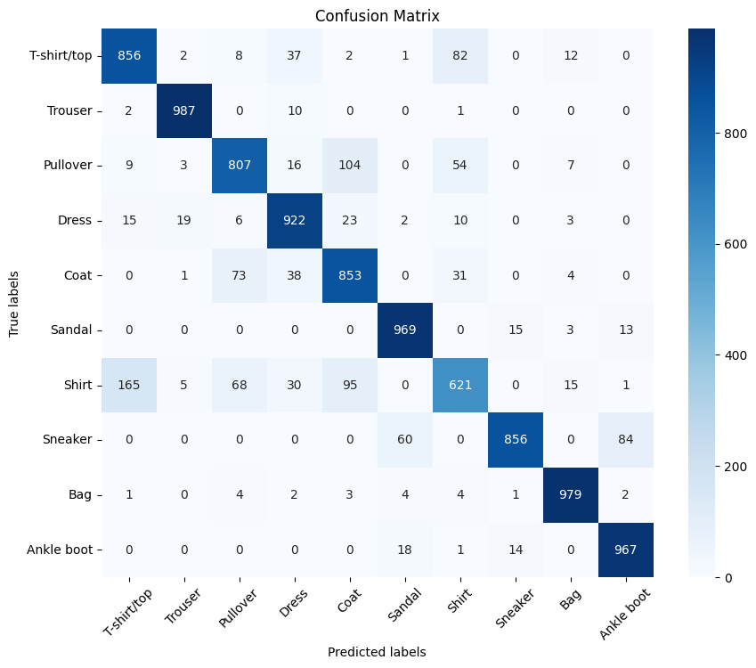
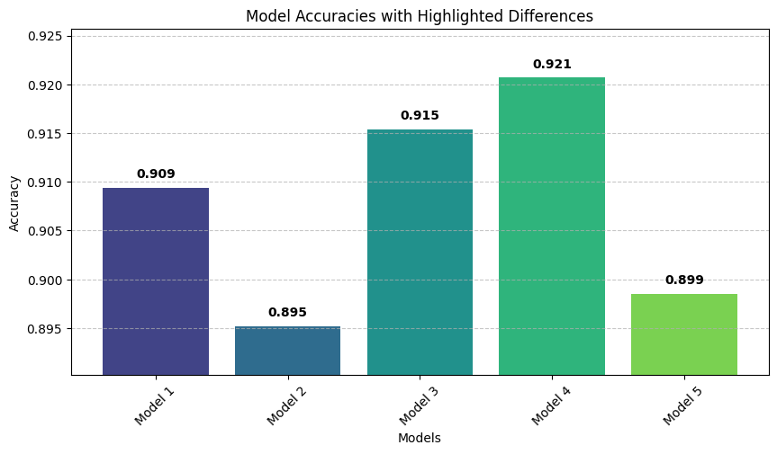
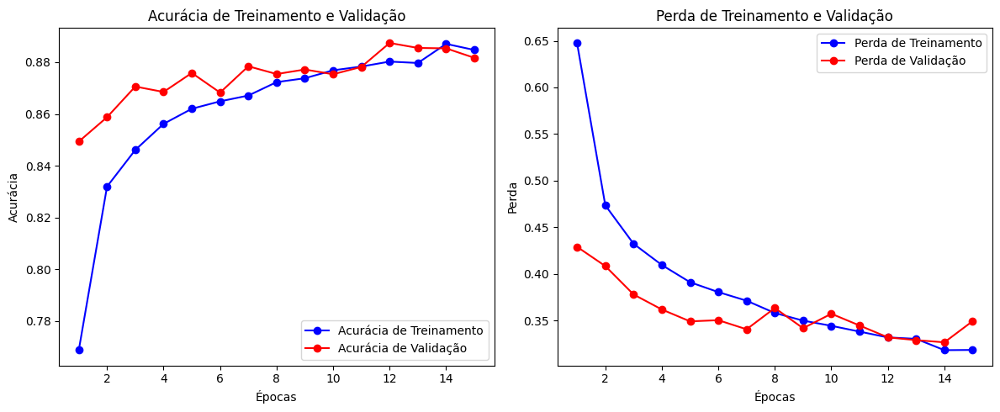

# CNN & MLP Fashion MNIST Classification

This project explores the application of Convolutional Neural Networks (CNNs) and Multilayer Perceptrons (MLPs) to the Fashion MNIST dataset. The objective is to experiment with different model topologies and dropout configurations to evaluate their impact on image classification performance. By comparing multiple architectures, the project demonstrates how design choices such as dropout layers can help mitigate overfitting and improve generalization.

## Table of Contents

1. [Background](#background)
2. [What are CNN and MLP Models?](#what-are-cnn-and-mlp-models)
3. [Tools I Used](#tools-i-used)
4. [The Process](#the-process)
5. [The Analysis](#the-analysis)
6. [What I Learned](#what-i-learned)
7. [Skills Practiced](#skills-practiced)
8. [Conclusion](#conclusion)
9. [Contact](#contact)
10. [Repository Structure](#repository-structure)

## Background

The Fashion MNIST dataset is a popular benchmark for evaluating machine learning models on image classification tasks. In this project, I experimented with various CNN architectures and compared them with a traditional MLP model. The focus was on understanding how changes in model topology and the inclusion of dropout layers affect the learning process and final classification accuracy.

## What Are CNN and MLP Models?

### Convolutional Neural Networks (CNNs)

**Core Idea:**  
CNNs are designed to handle grid-like data (e.g., images) by leveraging convolutional operations to capture local patterns such as edges, textures, and shapes.

**How They Work:**  
1. **Convolutional Layers** apply learned filters across the input to extract spatial features.  
2. **Pooling Layers** (e.g., max pooling) reduce spatial dimensions and help achieve translation invariance.  
3. **Fully Connected Layers** consolidate high-level features to produce final classification outputs.  
4. **Regularization** (e.g., dropout) helps prevent overfitting by deactivating neurons during training.

**Why They’re Effective:**  
Because CNNs exploit the spatial structure of images, they are generally more accurate and efficient than traditional fully connected networks for most computer vision tasks.

---

### Multilayer Perceptrons (MLPs)

**Core Idea:**  
MLPs are feedforward networks composed of multiple layers of fully connected neurons. They process vectorized input (e.g., flattened image pixels) and learn complex mappings from inputs to outputs through non-linear activations.

**How They Work:**  
1. **Input Layer** takes raw, vectorized data.  
2. **Hidden Layers** apply weighted connections and activation functions (e.g., ReLU) to learn intermediate representations.  
3. **Output Layer** produces the final prediction, often as class probabilities.

**Limitations for Images:**  
Without specialized operations like convolutions, MLPs do not inherently capture local spatial patterns, making them less effective than CNNs for image classification tasks.

## Tools I Used

- **Programming Language:** Python 3.12.8  
- **Interactive Environment:** Jupyter Notebook  
- **Libraries and Frameworks:**
  - TensorFlow/Keras or PyTorch for deep learning model implementation
  - NumPy and Pandas for data manipulation
  - Matplotlib for data visualization
  - scikit-learn for data preprocessing and evaluation metrics
- **Version Control:** Git

## The Process

The experimental process was structured in the following steps:

1. **Module Creation:**  
   I began by developing a module containing utility functions anticipated to be useful throughout the project.

2. **Data Analysis:**  
   An initial analysis was conducted on the Fashion MNIST dataset to understand its distribution and format. This step involved visualizing sample images and verifying label distributions.

3. **Model Planning and Strategy:**  
   I planned the experimental setup by deciding on the model architectures and variations to be tested. The strategy was as follows:
   - **Data Import and Preprocessing:**  
     The Fashion MNIST data was imported and preprocessed by reshaping it into the image dimensions required by the CNN.
   - **Model Architectures:**  
     The following CNN models were designed:
     - **Model 1:** Dropout=False | Topology: [64, 32, 16]
     - **Model 2:** Dropout=True  | Topology: [64, 32, 16]
     - **Model 3:** Dropout=False | Topology: [512, 256, 128]
     - **Model 4:** Dropout=True  | Topology: [512, 256, 128]
     - **Model 5:** Dropout chosen based on previous results | Topology: [512, 156, 128, 64, 32, 16]
   - Each model was trained for 15 epochs.
   - **MLP Model:**  
     After evaluating the CNN models, an MLP was trained using the same topology as the best performing CNN model. For the MLP, preprocessing was limited to normalizing the pixel values by dividing them by 255 (to scale the data between 0 and 1).

4. **Training and Evaluation:**  
   After training, I compiled the models' accuracies and losses. The project includes several plots stored in the `assets` folder to compare the performance of the models.

## The Analysis

The evaluation of the models revealed several key insights, illustrated by the figures below.  

---

### Confusion Matrix Insights

Analysis of the confusion matrices indicated specific categories that posed challenges for both CNN and MLP models:

- **Shirts vs. T-Shirts/Tops:**  
  Most CNN models struggled to correctly distinguish between shirts and t-shirts/tops.

- **Pullovers vs. Coats:**  
  There was noticeable overlap in predictions for pullovers and coats.

- **MLP Model Challenges:**  
  The MLP model had particular difficulty differentiating ankle boots from sneakers.

<div align="center">
  
</div>

_**Figure 1:** Confusion matrix for one of the best-performing CNN models, showing misclassifications between visually similar classes._

<div align="center">
  
</div>

_**Figure 2:** Confusion matrix for the MLP model, highlighting the model’s difficulty with footwear classes._

---

### CNN Training History and Performance

<div align="center">
  
</div>

_**Figure 3:** Training history (accuracy and loss) for the best CNN model. Notice how accuracy steadily improves while loss decreases over epochs._

<div align="center">
  
</div>

_**Figure 4:** Comparison of final accuracies among different CNN model architectures._

<div align="center">
  
</div>

_**Figure 5:** Loss curves for various CNN architectures, providing insights into learning speed and convergence._

---

### MLP Training History

<div align="center">
  
</div>

_**Figure 6:** Accuracy and loss trends for the MLP model over the course of training._

---

### Model Comparisons

Among the CNN architectures, **Models 3 and 4** (with topology `[512, 256, 128]`) showed the highest overall accuracy. **Model 4**, which incorporated dropout layers, proved slightly more robust by reducing overfitting. Although **Model 5** demonstrated a faster learning curve (as seen in the loss plots), its final performance was competitive with Model 4.

## What I Learned

- **Model Architecture Impact:**  
  Deeper models with a higher neuron count can capture more complex patterns but require effective regularization (such as dropout) to prevent overfitting.

- **Feature Extraction:**  
  CNNs excel in capturing spatial hierarchies from image data, a task where MLPs, due to their fully connected nature, fall short.

- **Class-Specific Challenges:**  
  Even well-tuned models can struggle with visually similar classes, as observed with shirts vs. t-shirts/tops and pullovers vs. coats. The MLP also had difficulty differentiating between ankle boots and sneakers.

- **Data Preprocessing:**  
  Proper normalization and reshaping of the data are essential steps, particularly for CNNs that rely on the spatial structure of images.

- **Environment Setup and Workflow:**  
  I learned how to run the latest version of TensorFlow on my GPU by leveraging **WSL2**, which involved configuring WSL2 with GPU support and integrating it with my **VSCode** environment and **Jupyter Notebook** for a seamless development experience.  
  **Shoutout to [Tech Jotters](https://youtu.be/VOJq98BLjb8?si=xcYCpKtP5OT72lRe)** for teaching me how to do it!


## Skills Practiced

- Designing and implementing deep learning models using both CNN and MLP architectures.
- Preprocessing and analyzing image data for classification tasks.
- Utilizing dropout layers to improve model generalization and mitigate overfitting.
- Visualizing training progress and model performance using embedded plots.
- Conducting detailed error analysis with confusion matrices.

## Conclusion

This project demonstrates the effectiveness of CNNs over MLPs for image classification tasks on the Fashion MNIST dataset. The experiments confirmed that:

- **CNN Advantages:**  
  Convolutional layers are highly effective at capturing the spatial structure of images, which is critical for distinguishing among similar classes.
- **Role of Dropout:**  
  Incorporating dropout layers (as seen in Model 4) helps mitigate overfitting, leading to more robust and accurate classification.
- **Classification Challenges:**  
  Despite overall strong performance, all models encountered difficulties in accurately differentiating between similar classes such as shirts versus t-shirts/tops and pullovers versus coats. Additionally, the MLP model struggled with distinguishing between ankle boots and sneakers, underscoring the importance of spatial feature extraction in image classification.

Overall, the project reinforces the value of choosing appropriate architectures and regularization techniques in deep learning, especially when addressing the nuances of image data.

## Contact

If you have any questions or feedback, feel free to reach out:  
[GitHub](https://github.com/faduzin) | [LinkedIn](https://www.linkedin.com/in/ericfadul/) | [eric.fadul@gmail.com](mailto:eric.fadul@gmail.com)

## Repository Structure

```
.
├── assets/           # Contains the images used in the analysis
├── data/             # Stores the datasets required for the project
├── notebooks/        # Includes Jupyter Notebook (.ipynb) files
├── src/              # Package with modules and modularized functions
├── .gitignore        # List of files and directories to be ignored by Git
├── license           # Project's license file
├── readme.eng.md     # English version of the README
└── readme.md            # Main README (in Portuguese), 
```
