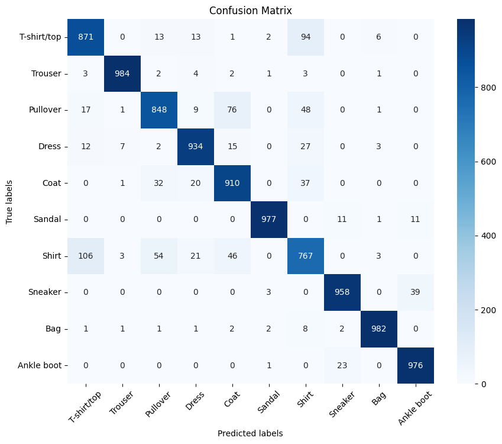
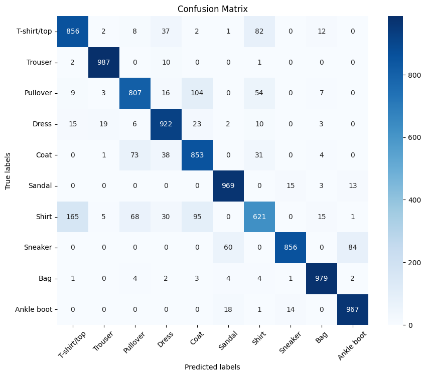
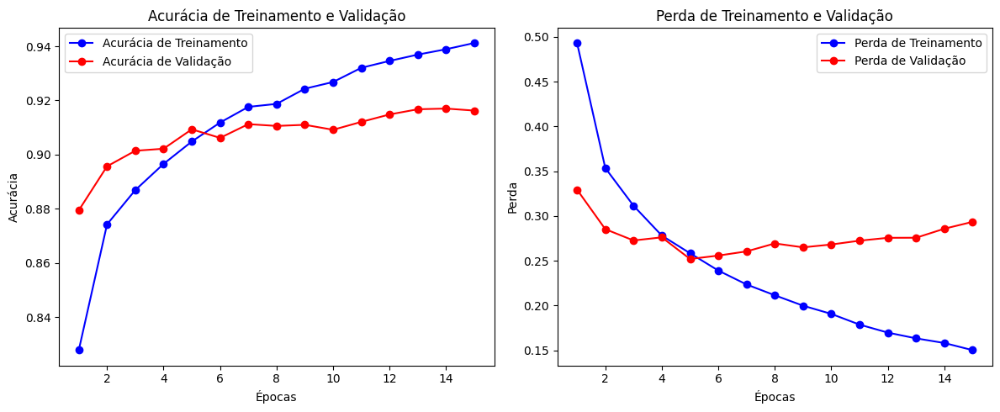
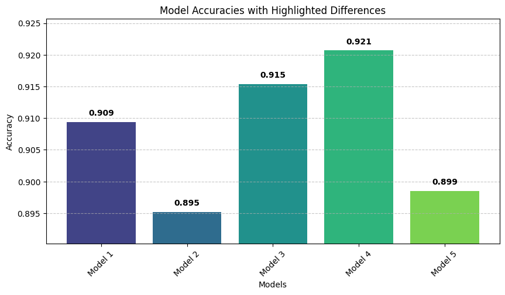
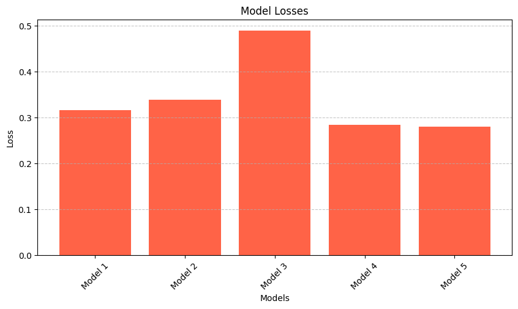
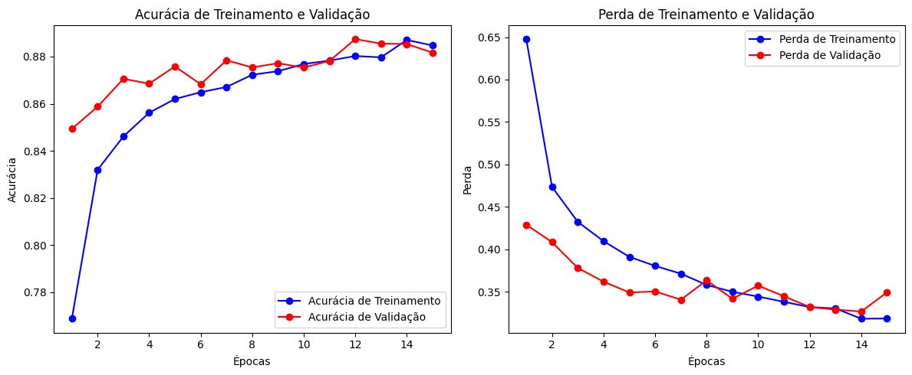

# Classificação de Moda MNIST com CNN & MLP

*To access this README in english, [click here](README.eng.md)*

Este projeto explora a aplicação de Redes Neurais Convolucionais (CNNs) e Perceptrons de Múltiplas Camadas (MLPs) ao conjunto de dados Fashion MNIST. O objetivo é experimentar diferentes topologias de modelo e configurações de dropout para avaliar seu impacto no desempenho de classificação de imagens. Ao comparar várias arquiteturas, o projeto demonstra como escolhas de design, como camadas de dropout, podem ajudar a mitigar overfitting e melhorar a capacidade de generalização dos modelos.

## Índice

1. [Contexto](#contexto)  
2. [O que são Modelos CNN e MLP?](#o-que-são-modelos-cnn-e-mlp)  
3. [Ferramentas Utilizadas](#ferramentas-utilizadas)  
4. [O Processo](#o-processo)  
5. [A Análise](#a-análise)  
6. [O que Aprendi](#o-que-aprendi)  
7. [Habilidades Praticadas](#habilidades-praticadas)  
8. [Conclusão](#conclusão)  
9. [Contato](#contato)
10. [Contribuições](#contribuições)
11. [Estrutura do Repositório](#estrutura-do-repositório)

## Contexto

O Fashion MNIST é um conjunto de dados popular para avaliar modelos de aprendizado de máquina em tarefas de classificação de imagens. Neste projeto, experimentei diversas arquiteturas de CNN e comparei-as com um modelo MLP tradicional. O foco foi entender como mudanças na topologia do modelo e a inclusão de camadas de dropout afetam o processo de aprendizado e a acurácia final de classificação.

## O que são Modelos CNN e MLP?

### Redes Neurais Convolucionais (CNNs)

**Ideia Principal:**  
As CNNs são projetadas para lidar com dados em formato de grade (por exemplo, imagens) ao utilizar operações de convolução para capturar padrões locais, como bordas, texturas e formas.

**Como Funcionam:**  
1. **Camadas Convolucionais** aplicam filtros aprendidos sobre a entrada para extrair recursos espaciais.  
2. **Camadas de Pooling** (por exemplo, max pooling) reduzem as dimensões espaciais e ajudam a alcançar invariância à translação.  
3. **Camadas Totalmente Conectadas** consolidam os recursos de alto nível para produzir as saídas de classificação finais.  
4. **Regularização** (por exemplo, dropout) ajuda a evitar overfitting ao desativar neurônios durante o treinamento.

**Por que São Eficazes:**  
Por explorarem a estrutura espacial das imagens, as CNNs costumam ser mais precisas e eficientes do que redes totalmente conectadas tradicionais na maioria das tarefas de visão computacional.

---

### Perceptrons de Múltiplas Camadas (MLPs)

**Ideia Principal:**  
Os MLPs são redes de alimentação direta compostas por múltiplas camadas de neurônios totalmente conectados. Eles processam entradas vetorizadas (por exemplo, pixels de uma imagem achatada) e aprendem mapeamentos complexos entre entradas e saídas por meio de ativações não lineares.

**Como Funcionam:**  
1. **Camada de Entrada** recebe os dados brutos em formato de vetor.  
2. **Camadas Ocultas** aplicam conexões ponderadas e funções de ativação (por exemplo, ReLU) para aprender representações intermediárias.  
3. **Camada de Saída** produz a previsão final, muitas vezes na forma de probabilidades de classe.

**Limitações para Imagens:**  
Sem operações especializadas como convoluções, os MLPs não capturam facilmente padrões espaciais locais, tornando-os menos eficazes do que as CNNs para classificação de imagens.

## Ferramentas Utilizadas

- **Linguagem de Programação:** Python 3.12.8  
- **Ambiente Interativo:** Jupyter Notebook  
- **Bibliotecas e Frameworks:**
  - TensorFlow/Keras ou PyTorch para implementação de modelos de deep learning
  - NumPy e Pandas para manipulação de dados
  - Matplotlib para visualização de dados
  - scikit-learn para pré-processamento e métricas de avaliação
- **Controle de Versão:** Git

## O Processo

A condução dos experimentos seguiu os passos abaixo:

1. **Criação de Módulo:**  
   Iniciei desenvolvendo um módulo contendo funções utilitárias que seriam úteis ao longo do projeto.

2. **Análise de Dados:**  
   Realizei uma análise inicial do conjunto de dados Fashion MNIST para compreender sua distribuição e formato. Essa etapa incluiu a visualização de imagens de exemplo e a verificação da distribuição dos rótulos.

3. **Planejamento e Estratégia de Modelos:**  
   Planejei a configuração experimental definindo as arquiteturas de modelo e variações que seriam testadas. A estratégia foi a seguinte:
   - **Importação e Pré-processamento de Dados:**  
     Os dados do Fashion MNIST foram importados e pré-processados, adequando seu formato às dimensões de imagem requeridas pela CNN.
   - **Arquiteturas de Modelo:**  
     Foram projetados os seguintes modelos de CNN:
     - **Modelo 1:** Dropout=False | Topologia: [64, 32, 16]  
     - **Modelo 2:** Dropout=True  | Topologia: [64, 32, 16]  
     - **Modelo 3:** Dropout=False | Topologia: [512, 256, 128]  
     - **Modelo 4:** Dropout=True  | Topologia: [512, 256, 128]  
     - **Modelo 5:** Dropout escolhido com base em resultados anteriores | Topologia: [512, 156, 128, 64, 32, 16]  
   - Cada modelo foi treinado por 15 épocas.
   - **Modelo MLP:**  
     Após avaliar os modelos de CNN, um MLP foi treinado com a mesma topologia do modelo de CNN que obteve melhor desempenho. Para o MLP, o pré-processamento se limitou à normalização dos valores de pixel, dividindo-os por 255 (para escalonar os dados entre 0 e 1).

4. **Treinamento e Avaliação:**  
   Depois do treinamento, compilei as acurácias e perdas dos modelos. O projeto inclui vários gráficos armazenados na pasta `assets` para comparar o desempenho dos diferentes modelos.

## A Análise

A avaliação dos modelos revelou diversos insights importantes, ilustrados pelas figuras abaixo.

---

### Análise de Matrizes de Confusão

A análise das matrizes de confusão mostrou categorias específicas que causaram dificuldades tanto para modelos CNN quanto para o modelo MLP:

- **Camisas vs. Camisetas/Tops:**  
  A maioria dos modelos de CNN apresentou dificuldade para distinguir corretamente camisas de camisetas/tops.

- **Pulôveres vs. Casacos:**  
  Houve sobreposição notável nas previsões entre pulôveres e casacos.

- **Desafios do Modelo MLP:**  
  O modelo MLP teve dificuldade especial em diferenciar botas de cano curto (ankle boots) de tênis (sneakers).

<div align="center">
  
</div>

_**Figura 1:** Matriz de confusão de um dos melhores modelos de CNN, mostrando erros de classificação entre classes visualmente semelhantes._

<div align="center">
  
</div>

_**Figura 2:** Matriz de confusão do modelo MLP, destacando a dificuldade na distinção entre classes de calçados._

---

### Histórico de Treinamento e Desempenho das CNNs

<div align="center">
  
</div>

_**Figura 3:** Histórico de treinamento (acurácia e perda) do melhor modelo de CNN. Note como a acurácia melhora gradualmente enquanto a perda diminui ao longo das épocas._

<div align="center">
  
</div>

_**Figura 4:** Comparação das acurácias finais entre diferentes arquiteturas de modelos de CNN._

<div align="center">
  
</div>

_**Figura 5:** Curvas de perda para várias arquiteturas de CNN, fornecendo insights sobre velocidade de aprendizado e convergência._

---

### Histórico de Treinamento do MLP

<div align="center">
  
</div>

_**Figura 6:** Tendências de acurácia e perda para o modelo MLP ao longo do treinamento._

---

### Comparações de Modelos

Entre as arquiteturas de CNN, **Modelos 3 e 4** (com topologia `[512, 256, 128]`) apresentaram a maior acurácia geral. O **Modelo 4**, que incorporou camadas de dropout, mostrou-se ligeiramente mais robusto ao reduzir overfitting. Embora o **Modelo 5** tenha demonstrado uma curva de aprendizado mais rápida (como visto nos gráficos de perda), seu desempenho final foi competitivo com o Modelo 4.

## O que Aprendi

- **Impacto da Arquitetura do Modelo:**  
  Modelos mais profundos com maior número de neurônios podem capturar padrões mais complexos, mas exigem regularização eficaz (como dropout) para evitar overfitting.

- **Extração de Recursos (Feature Extraction):**  
  CNNs se destacam na captura de hierarquias espaciais em dados de imagem, onde MLPs, por sua natureza totalmente conectada, não conseguem o mesmo desempenho.

- **Desafios em Classes Específicas:**  
  Mesmo modelos bem ajustados podem apresentar dificuldades com classes visualmente semelhantes, como camisas vs. camisetas/tops e pulôveres vs. casacos. O MLP também teve problemas em distinguir entre botas de cano curto (ankle boots) e tênis (sneakers).

- **Pré-processamento de Dados:**  
  Normalização e reformatação adequadas dos dados são etapas essenciais, principalmente para CNNs que dependem da estrutura espacial das imagens.

- **Configuração de Ambiente e Fluxo de Trabalho:**  
  Aprendi como executar a versão mais recente do TensorFlow na minha GPU utilizando **WSL2**, configurando suporte a GPU e integrando-o ao meu ambiente **VSCode** e **Jupyter Notebook** para uma experiência de desenvolvimento contínua.  
  **Agradecimento especial ao [Tech Jotters](https://youtu.be/VOJq98BLjb8?si=xcYCpKtP5OT72lRe)** por ensinar esse processo!

## Habilidades Praticadas

- Design e implementação de modelos de deep learning utilizando arquiteturas CNN e MLP.  
- Pré-processamento e análise de dados de imagem para tarefas de classificação.  
- Uso de camadas de dropout para melhorar a generalização do modelo e mitigar overfitting.  
- Visualização do progresso de treinamento e desempenho do modelo com gráficos incorporados.  
- Análise detalhada de erros com matrizes de confusão.

## Conclusão

Este projeto demonstra a eficácia de CNNs em comparação a MLPs para tarefas de classificação de imagens no conjunto Fashion MNIST. Os experimentos confirmaram que:

- **Vantagens das CNNs:**  
  Camadas convolucionais são altamente eficientes em capturar a estrutura espacial de imagens, essencial para distinguir classes semelhantes.

- **Papel do Dropout:**  
  A inclusão de camadas de dropout (como visto no Modelo 4) ajuda a mitigar overfitting, resultando em classificações mais robustas e precisas.

- **Desafios de Classificação:**  
  Apesar do bom desempenho geral, todos os modelos enfrentaram dificuldades para diferenciar classes semelhantes, como camisas versus camisetas/tops e pulôveres versus casacos. Além disso, o modelo MLP apresentou problemas para distinguir entre botas de cano curto (ankle boots) e tênis (sneakers), ressaltando a importância da extração de recursos espaciais na classificação de imagens.

No geral, o projeto reforça a importância de escolher arquiteturas e técnicas de regularização adequadas em deep learning, especialmente ao lidar com as sutilezas de dados de imagem.

## Contribuicões

- Tayenne Euqueres
- William de Oliveira Silva

## Contato

Se você tiver qualquer dúvida ou comentário, fique à vontade para entrar em contato:  
[GitHub](https://github.com/faduzin) | [LinkedIn](https://www.linkedin.com/in/ericfadul/) | [eric.fadul@gmail.com](mailto:eric.fadul@gmail.com)

## Estrutura do Repositório

```
.
├── assets/           # Contém as imagens utilizadas na análise
├── data/             # Armazena os datasets necessários para o projeto
├── notebooks/        # Inclui os arquivos Jupyter Notebook (.ipynb)
├── src/              # Pacote com módulos e funções modularizadas
├── .gitignore        # Lista de arquivos e pastas ignorados pelo Git
├── license           # Arquivo de licença do projeto
├── readme.eng.md     # Versão em inglês do README
└── readme.md            # README principal (em português), descrevendo o projeto e instruções gerais
```
